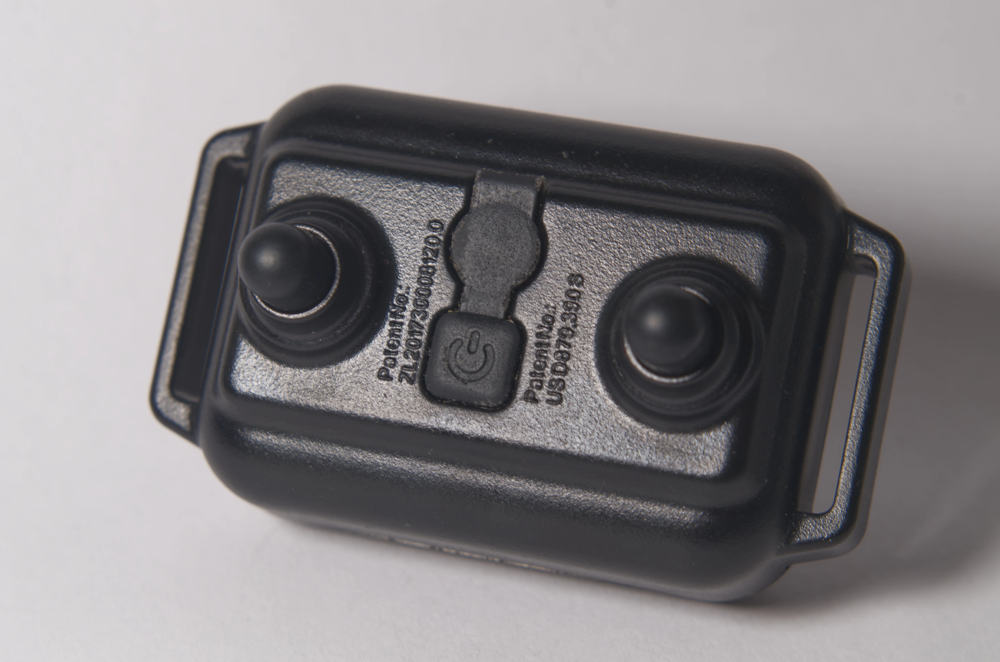

---
tags:
    - hardware
    - shockers
---

# CaiXianlin

!!! success "Compatible"
    This product is compatible with OpenShock.

Cheap and easily acquirable.

## Buying

### Shockers

Best effort list of current AliExpress sellers. Feel free to add more sources to this list!

- :globe_with_meridians: International: [AliExpress](https://aliexpress.com/item/1005005133046985.html)
- :flag_nl: Netherlands: [AliExpress](https://nl.aliexpress.com/item/1005005359066763.html)

### Cables

The charging port for this model is a standard **DC 3.5 x 1.35mm**. A USB to **DC 3.5 x 1.35mm** cable is used to charge the shocker. You might even have one laying around as they are common.

- :globe_with_meridians: International: [AliExpress](https://aliexpress.com/item/2255799944669970.html)

## Media





Thank you `@dasbrin` on Discord for the images.


## Technical Specification

### Official documents

[US Patent Document 1](https://uspto.report/patent/grant/D879,390)

[US Patent Document 2](https://image-ppubs.uspto.gov/dirsearch-public/print/downloadPdf/D879390)

### RF Specification

| Name              | Value      |
|-------------------|------------|
| Carrier Frequency | 433.95 MHz |
| Modulation Type   | ASK / OOK  |
| Baud Rate         | 3950 Hz    |

### Message Format

> The hex values represent the encoded result, ready to be transmitted at 3950 Hz baud

| Name              | Value      | Length  | Remarks |
|-------------------|------------|---------|---------|
| Prefix            | 0xFC       | 2 bits  |         |
| Transmitter ID    | 0 - 65535  | 16 bits | The collar will be Paired to this |
| Channel Number    | 0 - 2      | 4 bits  | The collar will be Paired to this |
| Action Command    | 1 - 3      | 4 bits  | 1 = Shock, 2 = Vibrate, 3 = Beep  |
| Command Intensity | 0 - 99     | 8 bits  | Should always be 0 for beep       |
| Message checksum  | Calculated | 8 bits  | (sum of everything in front except prefix) modulo 256 |
| Postfix           | 0x88       | 2 bits  | |

#### Layout

```text
[PREFIX        ] = XX
[TRANSMITTER ID] =   XXXXXXXXXXXXXXXX
[CHANNEL       ] =                   XXXX
[MODE          ] =                       XXXX
[STRENGTH      ] =                           XXXXXXXX
[CHECKSUM      ] =                                   XXXXXXXX
[END           ] =                                           XX
```

#### Encoding

> The following applies to a baud rate of 3950 Hz

Every ``1`` is encoded as ``1110`` or ``0xE``
Every ``0`` is encoded as ``1000`` or ``0x8``

### Examples

> Names are formatted as: Channel number (CH1), Command (SHOCK), Strength (99)
> For all examples the Transmitter ID ``46231`` is used

```text
[CH1 SHOCK   00] = fc e8ee8e88e88e8eee 8888 888e 88888888 8e88ee88 88
[CH1 SHOCK   01] = fc e8ee8e88e88e8eee 8888 888e 8888888e 8e88ee8e 88
[CH1 SHOCK   02] = fc e8ee8e88e88e8eee 8888 888e 888888e8 8e88eee8 88
[CH1 SHOCK   03] = fc e8ee8e88e88e8eee 8888 888e 888888ee 8e88eeee 88
[CH1 SHOCK   50] = fc e8ee8e88e88e8eee 8888 888e 88ee88e8 8eeeeee8 88
[CH2 SHOCK   50] = fc e8ee8e88e88e8eee 888e 888e 88ee88e8 e888eee8 88
[CH3 SHOCK   50] = fc e8ee8e88e88e8eee 88e8 888e 88ee88e8 e88eeee8 88
[CH1 VIBRATE 50] = fc e8ee8e88e88e8eee 8888 88e8 88ee88e8 8eeeeeee 88
[CH2 VIBRATE 50] = fc e8ee8e88e88e8eee 888e 88e8 88ee88e8 e888eeee 88
[CH3 VIBRATE 50] = fc e8ee8e88e88e8eee 88e8 88e8 88ee88e8 e88eeeee 88
[CH3 VIBRATE 99] = fc e8ee8e88e88e8eee 88e8 88e8 8ee888ee ee8e8888 88
[CH1 SOUND     ] = fc e8ee8e88e88e8eee 8888 88ee 88888888 8e88eee8 88
[CH2 SOUND     ] = fc e8ee8e88e88e8eee 888e 88ee 88888888 8e8eeee8 88
[CH3 SOUND     ] = fc e8ee8e88e88e8eee 88e8 88ee 88888888 8ee8eee8 88
[CH1 SHOCK   00] = fc e8ee8e88e88e8eee 8888 888e 88888888 8e88ee88 88
[CH1 SHOCK   99] = fc e8ee8e88e88e8eee 8888 888e 8ee888ee e8e8eeee 88
[CH1 VIBRATE 00] = fc e8ee8e88e88e8eee 8888 88e8 88888888 8e88ee8e 88
[CH1 VIBRATE 99] = fc e8ee8e88e88e8eee 8888 88e8 8ee888ee e8ee8888 88
```

### Example untested RFCat code

```py
# Import the necessary libraries and functions
from rflib import *
import time

# Set up the RfCat device
d = RfCat()
d.setPktPQT(0)
d.setMdmNumPreamble(0)
d.setEnableMdmManchester(False)
d.setFreq(433950000)
d.setMdmModulation(MOD_ASK_OOK)
d.setMdmDRate(3950)
d.makePktFLEN(22)
d.setMdmSyncWord(0)
   
"""
Returns the string representation of the action (Shock, Vibrate, or Beep)
"""
def get_action_string(action):
   if action == 1:
      return 'Shock'
   elif action == 2:
      return 'Vibrate'
   elif action == 3:
      return 'Beep'
   else:
      return 'Unknown'

# Since the receivers only support 3 channels, we can change the transmitter ID to extend the number of channels
for transmitter_id in range(46231, 46233):
   # Loop through the channels
   for channel in range(3):
      # Loop through the actions
      for action in range(1, 4):
         # Loop through the intensities, but not if the action is 3 (beep)
         for intensity in range(0, 100, 10) if action != 3 else [0]:

            # Intensity has max of 99
            if intensity == 100:
               intensity = 99

            # Assemble the payload
            payload = (transmitter_id << 24) | (channel << 20) | (action << 16) | (intensity << 8)

            # Calculate the checksum (sum(bytes) % 256)
            checksum = 0
            for i in range(8):
               checksum += (payload >> (i * 8)) & 0xFF
            checksum %= 256

            # Add the checksum to the payload
            payload |= checksum

            # Assemble the message
            message = bytes.fromhex('fc{0:040b}88'.format(payload).replace('1', 'e').replace('0', '8'))

            print('Sending {0} on channel {1} with intensity {2} and checksum {3}'.format(get_action_string(action), channel, intensity, checksum))

            # Transmit the message 5 times
            for i in range(5):
               d.RFxmit(message)
```
